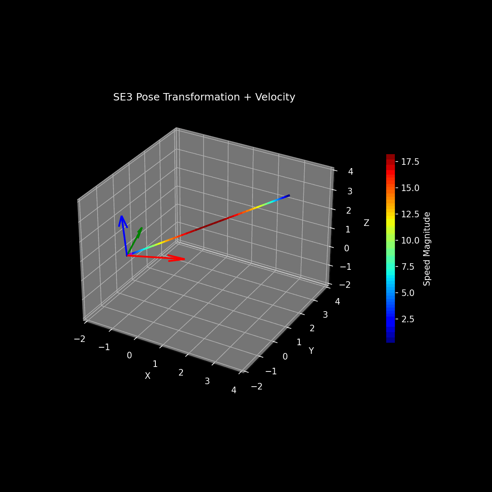

# Geometrical-Transformation

## 💡 Why SLERP?

When interpolating rotations (e.g., in 3D animation or robotics), naive interpolation methods like Linear Interpolation (LERP) can cause issues:

- **Non-uniform motion** (fast at start/slow at end, or vice versa)  
- **Incorrect intermediate rotations** (deviations from the unit sphere)  
- **Gimbal lock** when using Euler angles  

**SLERP solves these problems by**:  
1. Maintaining unit norm (correct rotation representation)  
2. Moving at constant angular velocity (smooth motion)  
3. Avoiding gimbal lock (works directly with quaternions)  

Ideal for animations and rigid body motion planning.

## 📐 How Does SLERP Work?

Given two unit quaternions $q_0$ and $q_1$, and interpolation parameter $t \in [0,1]$, SLERP is defined as:

$$\text{SLERP}(q_0, q_1, t) = \frac{\sin((1-t)\theta)}{\sin(\theta)} q_0 + \frac{\sin(t\theta)}{\sin(\theta)} q_1$$

Where:  
- $\theta = \cos^{-1}(q_0 \cdot q_1)$ (angle between quaternions)  
- $q_0 \cdot q_1$ is the dot product  

**Important implementation note**:  
If $q_0 \cdot q_1 < 0$, negate $q_1$ before interpolation to take the shorter path on the 4D hypersphere (quaternions exhibit double-cover symmetry).

## 🧠 Geometric Intuition

Imagine orientations as points on a sphere:  
- SLERP follows the **great arc** (shortest path) between $q_0$ and $q_1$  
- Analogous to a great-circle flight path on Earth  
- Maintains constant speed (angular velocity)  
- Preserves rotational integrity at every intermediate step  

